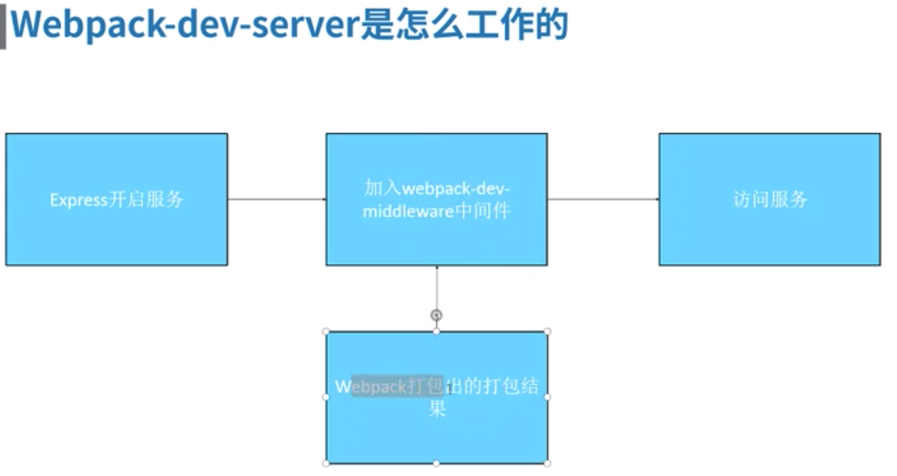
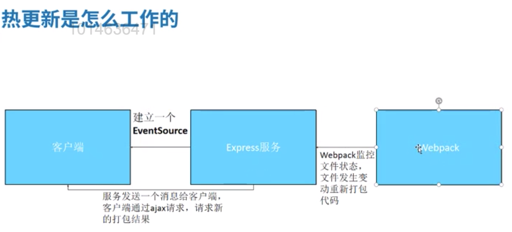

# Webpack dev server

`npm start` and access `localhost:9002` given by devServer in webpack.config.js.

## Difference between `webpack-dev-server` and `npm start`

Run `webpack-dev-server` in command line directly will call global webpack, while `npm start` will run local webpack. So to be compatible with some old projects, we can add local webpack and run it.

## Enable hot replacement

**Why hot?**

1. **No need to reload browser**
1. **Keep application state**

By default, hot is not enable, instead, webpack uses reloader for any css or js changes. Browsers will refresh the whole page and load the latest resource, but the shortcoming is that application state is lost. Especially css change doesn't need to reload the page.

**To enable hot update for CSS**, do below:

```javascript
devServer: {
  port: 9002,
  overlay: true, // overlay if UI raises some errors while compiling
  hot: true, // enable hot feature step1
},
plugins: [
  new htmlWebpackPlugin({
    filename: 'index.html',
    template: './index.html',
    minify: {
      collapseWhitespace: true,
    },
    inject: true,
  }),
  new webpack.HotModuleReplacementPlugin(), // enable hot feature step2
],
```

_Don't forget to restart the webpack dev server after changing config._

**Above only enable hot replacement for CSS, for Javascript, add below into the js file that you wanna enable hot**:

`module.hot.accept();`

Only when adding this, this javascript file's hot feature is enable. `accept function` can pass config that guides which module enables hot feature.

When there is any change in code, browser network adds below:

- <http://localhost:9002/aa1ac1759574daf63ce3.hot-update.json> response `{"h":"25b9ebf332e1c57268de","c":{"app":true}}`
- <http://localhost:9002/app.aa1ac1759574daf63ce3.hot-update.js> response

```javascript
webpackHotUpdate('app', {
  './app.js': function(module, __webpack_exports__, __webpack_require__) {
    'use strict';
    eval('........');
  },
});
```

## proxy

in dev mode, webpack dev server proxy can solve CORS issue. javascript request has CORS, but node.js request won't have CORS issue. So webpack dev server uses proxy and express to send api request, CORS is solved just like this.

in production mode, proxy won't work any more, so server needs to set allow origin to solve CORS issue.

```javascript
$.ajax({
  url: '/api/study',
  type: 'get',
  success: function(data) {
    console.log(data);
  },
});

// webpack config
proxy: {
  '/': {
    target: 'https://study.163.com',
    changeOrigin: true,
    pathRewrite: {
      '^/api/study': '/smartSpec/intro.htm',
    },
  },
},
```

## Principle




